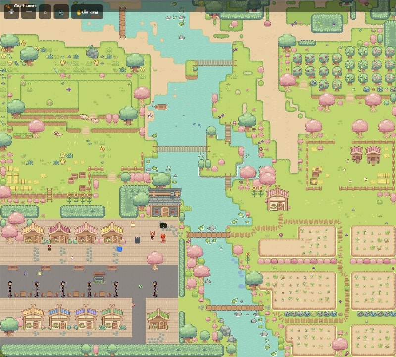

# 暖爪小窝 Cozy Claw

像素风 RPG 小世界，用 Phaser 3 + Tiled 地图编辑器搭建。

有季节系统（春夏秋冬）、河流、木桥、樱花树、商铺街、农田花圃。角色可以在地图上走动，和 NPC、宠物互动。



## 快速开始

最简单的方式——直接用浏览器打开 `index.html` 就能玩，不需要任何后端。

如果需要实时状态同步（多人联动）：

```bash
pip install fastapi uvicorn
python main.py
```

打开 http://localhost:8080。

## 操作

- **方向键 / WASD**：移动角色
- **E**：进入建筑
- **鼠标滚轮**：缩放
- **拖拽**：移动视角

## 技术栈

- **前端**：Phaser 3 + 原生 JS
- **地图**：Tiled 编辑器（.tmx → JSON）
- **后端**：FastAPI + WebSocket（可选，提供实时状态同步）
- **美术**：Sprout Lands 素材包 + 手绘像素角色

## 地图编辑

地图工程文件在 `tiled-project/` 目录下，用 [Tiled Map Editor](https://www.mapeditor.org/) 打开 `cozy-claw.tmx` 即可编辑。

## 许可

美术素材来自 [Sprout Lands](https://cupnooble.itch.io/) 素材包（需自行购买授权）。代码部分 MIT License。
